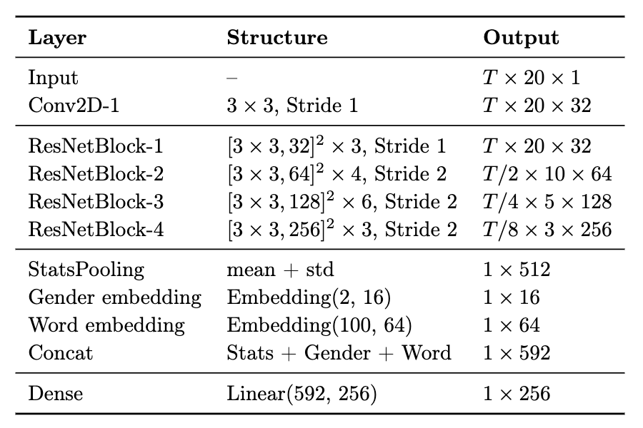
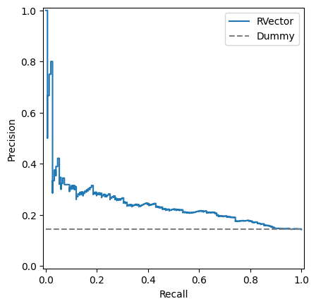

# vocotrack

Child speech mispronunciation detection

## RVector Architecture

The RVector model is a CNN architecture designed for speaker/speech recognition tasks, adapted here for mispronunciation detection.

**Description**:

* **Backbone:** ResNet-34 like structure with convolutional layers to process MFCC spectrograms.
* **Input:** MFCC (T x 20 x 1), Gender ID, Word ID, and actual sequence length (for handling padding).
* **Pooling:** Statistical Pooling layer (mean + standard deviation) is applied after the ResNet backbone.
* **Embeddings:** Gender and Word ID are passed through embedding layers.
* **Concatenation & Dense Layer:** The pooled features and embeddings are concatenated and passed through a dense layer to produce a 256-dimensional feature vector.
* **Classifier Head:** A final linear layer maps the 256-d vector to 2 output classes (correct/incorrect)

The model implementation is modular, using PyTorch Lightning for structured training. Configuration is managed via Pydantic models for flexibility and validation.

### Software Stack

* **Core ML:** PyTorch, PyTorch Lightning
* **Hyperparameter Optimization:** Ray Tune, Optuna
* **Data Handling:** Pandas, NumPy
* **Audio Processing:** Librosa
* **Classical ML:** Scikit-learn
* **Environment:** Remote server (DigitalOcean droplet with 8GB RAM, 4 Intel cores, 240GB SSD, Ubuntu 22.04 LTS) used for training.

## Results

* **Dummy Classifier (Baseline):** AUC PR = 0.143 (reflects class imbalance)
* **Logistic Regression (MFCC stats):** AUC PR = 0.280 (validation)
* **Random Forest (MFCC stats - Best Classical):** AUC PR = 0.307 (validation)
* **XGBoost (MFCC stats):** AUC PR = 0.280 (validation)
* **CatBoost (MFCC stats):** AUC PR = 0.286 (validation)
* **RVector (CNN):**
    * Best during tuning: AUC PR = 0.3186 (validation)
    * After final training: AUC PR = 0.3223 (validation)
    * **Test Set Performance:** AUC PR = 0.2418
  

The RVector model showed the best performance on the validation set, outperforming classical ML approaches. The test set performance indicates the challenging nature of the task and room for further improvement. Here is PR-curve:

